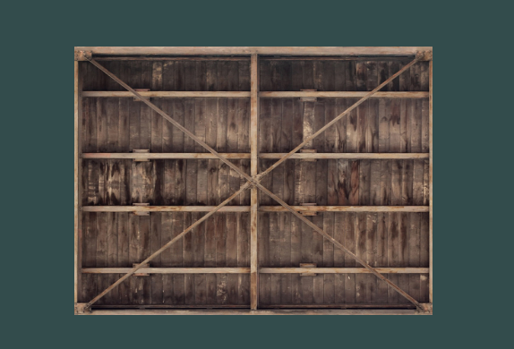
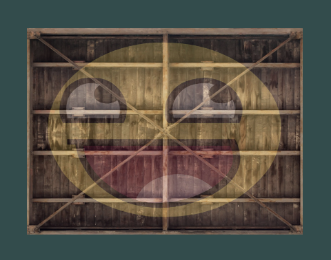

> 3D Render Engine used to learn Computer Graphics, implemented in C++ and OpenGL

**currently supporting:**
* Rendering Simple Shapes

  
* Rendering Textured Shapes

  
* Multiple Textures for each Shape

