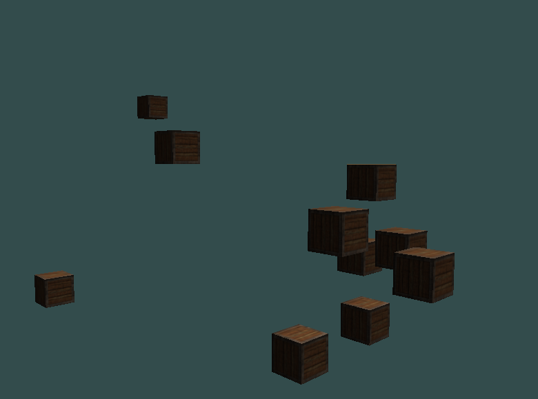
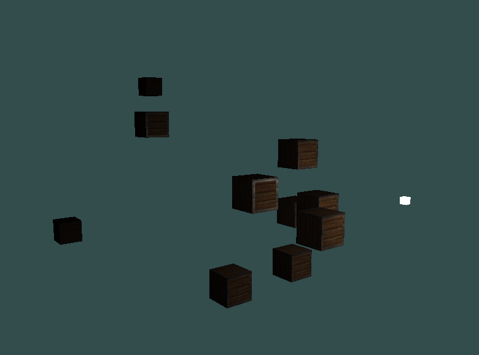

> 3D Render Engine used to learn Computer Graphics, implemented in C++ and OpenGL
> Following learnopengl.com

**currently supporting:**

Rendering Cubes with color and basic lighting!

Directional Lights:

Point Lights:

