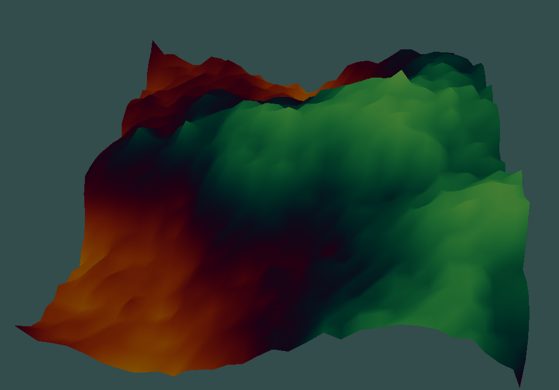

> 3D Render Engine used to learn Computer Graphics, implemented in C++ and OpenGL

**currently supporting:**

Perlin Noise Generation!

Procedural Terrain Generation using Diamond-Square Algorithm!

And with Directional Light:

